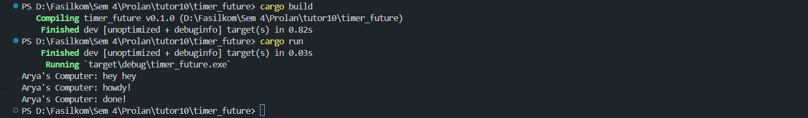
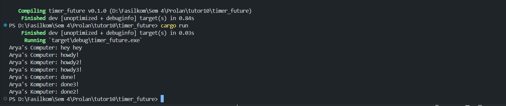
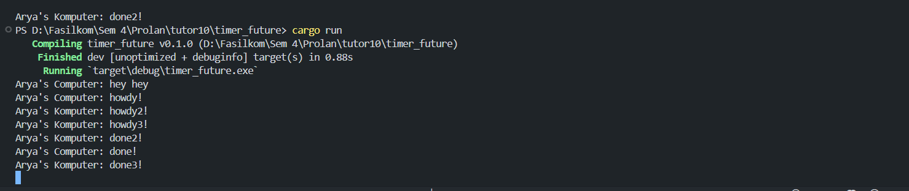

## 1.2. Understanding how it works.
Berikut adalah hasil dari modifikasi `Try to add another print just after the spawn` : <br>
 <br>
Perintah dari ```println!("Arya's Computer: hey hey");``` akan dieksekusi terlebih dahulu karena ia tidak masuk di dalam ```spawner.spawn``` yang berarti ia tidak akan menunggu fungsi asynchronus ```async``` dijalankan terlebih dahulu melainkan akan langsung dijalankan saja. Setelah itu baru perintah async yang ada di dalam spawner dieksekusi, yang mana pertama-tama akan menjalankan ```println!("Arya's Computer: howdy!");``` kemudian terdapat delay 2 detik sebelum menjalankan perintah ```println!("Arya's Computer: done!");``` sehingga urutan outputnya adalah demikian

## Multiple Spawn
 <br>
Ketika menambahkan dua buah spawner.spawn lagi dengan semua waktu delay nya sama yaitu 2 detik, ternyata output dari ```done``` tidak berurutan, tetapi urutannya adalah ```done2!``` > ```done!``` > ```done3!```. Hal tersebut karena pengeksekusian spawner berjalan secara concurrency alias bersamaan atau paralel sehingga bukan berarti output done nya pasti akan berurutan sesuai dengan letak line nya. 

## Removing statement: drop(spawner);

Ketika kita menghilangkan perintah ``drop(spawner);``, maka program tidak akan pernah berhenti. Hal tersebut karena drop(spawner) sendiri bertugas untuk mematikan berjalannya spawner. Fungsi spawner.spawn sendiri adalah seperti men - spawn atau memunculkan sesuatu, dalam hal ini adalah suatu string message. Jika drop(spawner) dijalankan, maka ia akan memerintah spawner untuk berhenti eksekusi. Dengan menghilangnya drop(spawner), maka spawner akan terus berjalan walaupun sudah tidak ada lagi pesan yang dikirim.